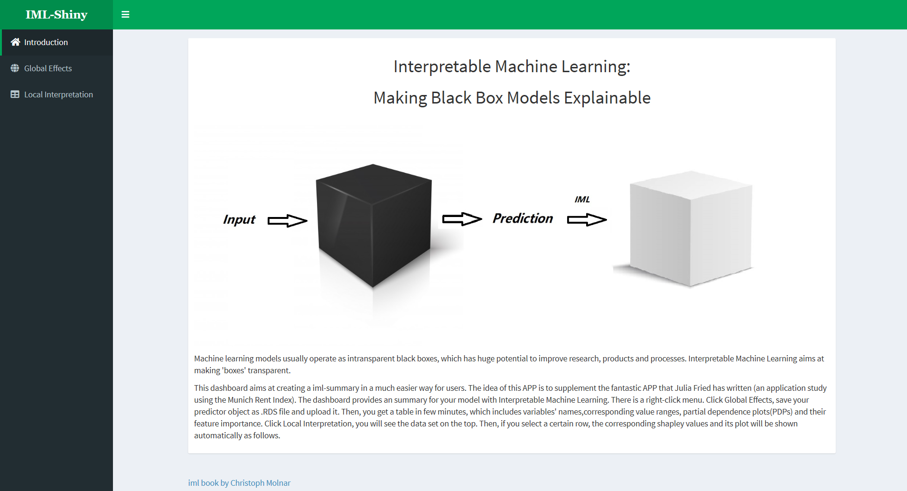
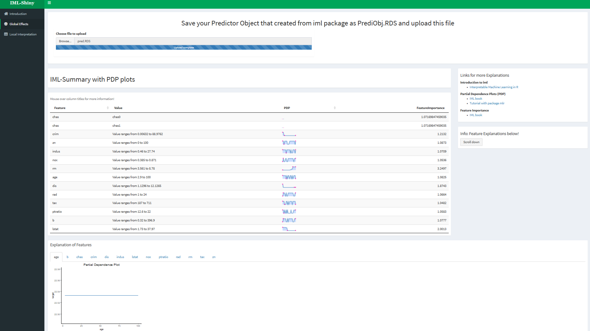
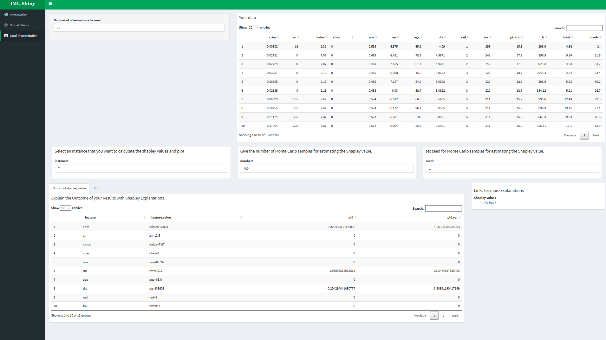

# iml–summary

This dashboard provides an iml-summary for your data. The app shows the
partial dependence plots and permutation feature important for any
machine learning model. It can also explain individual predictions with
Shapley Values.







## File Structure

The general structure of this repo does have the following tree :

    ├───app 
    ├───pdPlots
    ├───example
    │   └───PrediObj
    │   └───test_model
    ├───www
    |└─── Cover
    |
    └───libraries

## How to use

You can use this shinydashboard app for your predictor object (R6Class
object), which should hold any machine learning model (mlr, caret,
randomForest, …) and the data to be used of analysing the model. The
package iml and mlr can help you. There is an example of R code how to
produce an `.RDS` model object with iml and mlr as below.

There is a right-click menu in this shinydashboard. Click Global
Effects, save your predictor object as `.RDS` file and upload it. Then,
you get a table in few minutes, which includes variables’ names,
corresponding value ranges, partial dependence plots(PDPs) and their
feature importance values. Click Local Interpretation, you will see the
data set on the top. Then, if you select a certain row, the seed and the
number of Monte Carlo samples for estimating the shapley value, the
corresponding shapley values and its plot will be shown automatically as
follows.

Read more about the methods in the [Interpretable Machine Learning
book](https://christophm.github.io/interpretable-ml-book/agnostic.html)

Read more about the information in the [Machine Learning in
R](https://mlr.mlr-org.com/index.html)

## Example

  - First we train a Tree-Based Regression Models to predict the Boston
    median housing value. Open R file `test_model.R`, run the code as
    follows, the `pred.RDS` will be saved in the file `\example`

<!-- end list -->

``` r
rm(list = ls(all.names = T))
library(iml)
library(mlr)
lrn = makeLearner("regr.rpart")
tsk = bh.task
dat = getTaskData(bh.task)
mod = train(lrn, tsk)
pred = Predictor$new(mod, dat)
saveRDS(pred, file = "example/pred.RDS")
```

  - Open R file `app.R`, then, click the button “run App”, which is
    placed right above. And you will get a shinydashboard. Click Global
    Effects on the right-click menu, upload the `pred.RDS`……(see above)
